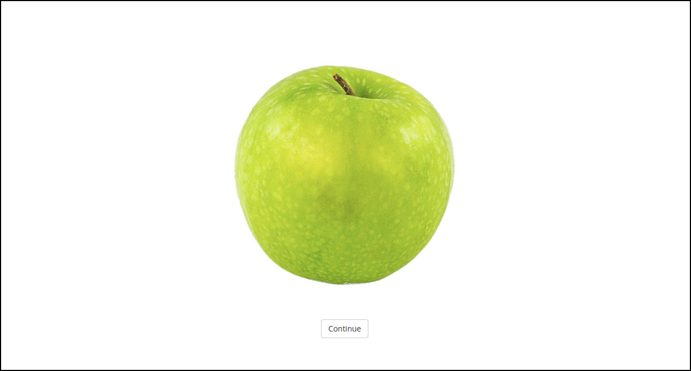

# Before/after a Patch

This page describes events that can occur before a patch is started or after it has ended!

## Before a Patch

### Instructions before the patch starts

This can be achieved via the "intro" attribute of a patch type.

TODO: A better explanation will follow!

### Images before the patch starts



If you want to display an image before the patch starts, you can use the "pre_trial" attribute in the patch_type.

```javascript
"patch_types": [
  {
    "id": "A",
    "name": "ConditionA",
    "background_color": "#0A00AA",
    "intro": "<p>Welcome!</p>",
    "pre_trial": {"image": "apple.jpg"},
    // Further entries go here ....
```
 
In the example above, an image of an apple is displayed before the trial (don't ask why....). The apple.jpg needs to be located in the "stimuli" folder. A "continue" button terminates the screen to start the patch. 


If instead you want the screen to stop automatically, you can define a time. In the example below, the image terminates after 3 seconds:

```javascript
"pre_trial": {
  "image": "apple.jpg",
  "time": 3000
},
```

If you need to mask your image after a while, you can do it like this:

```javascript
"pre_trial": {
   "image": "apple.jpg",
  "time": 3000,
  "mask_image": "apple_mask.jpg",
  "mask_image_time": 3000
},
```

If instead of an image you want to show arbitrary HTML, follow this example, that shows three letters and masks them with xs:

```javascript
"pre_trial": {
  "html": "A B C",
  "time": 3000,
  "mask_html": "X X X",
  "mask_html_time": 3000
},
```
## After a patch 

If you want to record a judgment right after a patch, you can add a post_trial attribute to the patch_type:  

```javascript
"patch_types": [
  {
    "id": "A",
    "name": "ConditionA",
    "background_color": "#0A00AA",
    "intro": "<p>Welcome!</p>",
    "post_trial": {
      "html": "Who did this make you feel?",
      "choices": ["Good", "Bad", "I want to sleep now"]
     },
    // Further entries go here ....
```

This will show some buttons. Note that you can also use something like "" inside the choices to put images on the buttons.
