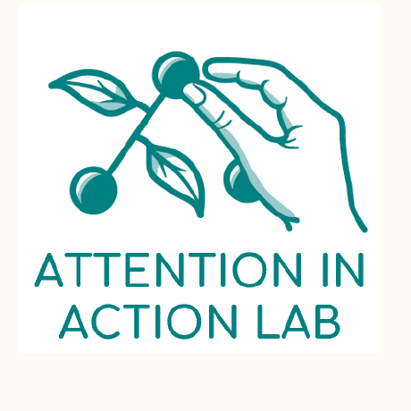

# The ForagingFlipKit Documentation

... is heavily under construction. Here is brief overview of what's already there (and what's missing):

* There is a [Quick Start](quickstart.md) guide that explains how to download and that coveres the project structrue

* There is a [Config Entries](configentries.md) overview. The ``config.js`` file is the heart of the ForagingFlipKit. In it, you can descriptively specifiy your experiment (without any real programming). But that means, there is a large list possible entries for all kind of details. Currently, only a small subset is documented. This will be improved soon!

* There is an [Experimental Design](design.md) page. Currently it's just a stub. But will soon be filled with info on how to achieve particular experimental designs.

* There are pages on how to implement [Time Limits](timelimits.md) with a countdown and how to handle [Audio](audio.md) such as background music or click sounds. More pages dedicated particular aspects will be added soon, as for example, how to control data saving or packaging the experiments as online experiments.

