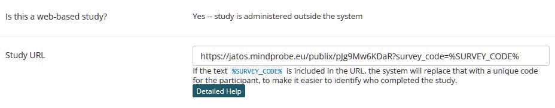
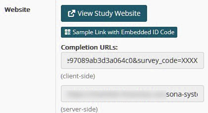

# Saving Data

There are different ways to save experimental data, which are explained below.

## Offline

To collect data offline (e.g. in the lab), set the data mode to `offline`:

```javascript
data: {
  mode: "offline"
},
```

In this mode, an input box appears at the beginning of the experiment, asking for a participant ID. This ID is included in the result file name, which will be `participant-[ID].json`.

The result file is provided by the browser as a download (even if the experiment runs fully offline). Depending on your browser, you may either be prompted to choose a destination or the file will automatically be saved to the default download folder (e.g. `Downloads`).

You can also choose `offline-random`:

```javascript
data: {
  mode: "offline-random"
},
```

In this mode, the participant is not asked for an ID. Instead, a random participant ID is generated automatically.

## Online

Set the mode to `online` if you want to collect data online, e.g. via a JATOS server.

```javascript
data: {
  mode: "online"
},
```

## Online with SONA integration

To enable automatic credit approval for studies distributed via SONA, information has to be exchanged between three places:

a) **The SONA study URL**

The study URL in SONA must include the parameter `survey_code=%SURVEY_CODE%`, see image below.

- If the URL does not already contain parameters, append it using `?`:
  ```
  https://your-study-url?survey_code=%SURVEY_CODE%
  ```
- If the URL already contains parameters (i.e. it already contains a `?`), append it using `&`:
  ```
  https://your-study-url?foo=bar&survey_code=%SURVEY_CODE%
  ```



b) **The SONA completion URL**

Once `survey_code=%SURVEY_CODE%` is part of the study URL, the main study page in SONA displays example completion URLs, see below:



c) **The experiment configuration**

Add the completion URL from SONA to your experiment's `config.js` file.

For example, add the following at the end, before the final closing "}":

```javascript
completion_url: "https://..."
```

Replace `"https://..."` with the completion URL copied from SONA.

> **Important:** The `completion_url` in `config.js` must **not** include the `survey_code=...` parameter. This parameter is added automatically.

### Setup procedure

Because the study URL and completion URL depend on each other, the initial setup requires the following workflow:

**Step 1:** Create the study in SONA.

For the study URL, temporarily enter a dummy URL, for example:

```
https://dummy.dummy?survey_code=%SURVEY_CODE%
```

Save the study and return to its main page.

**Step 2:** Copy the completion URL from the SONA study page (see **b** above), but remove the `survey_code=...` part before copying it into the `completion_url` entry in `config.js`.

Save the configuration and package your experiment (e.g. using the packaging scripts in the `tools` folder).

**Step 3:** Import the packaged experiment into JATOS as a new study.

Then obtain the study URL from the **Workers & Batches** section (for example, a `general_single` link).

**Step 4:** Return to your SONA study and replace the dummy URL with the JATOS study URL.

Append `survey_code=%SURVEY_CODE%` to the URL:
- use `?survey_code=%SURVEY_CODE%` if there are no existing URL parameters;
- use `&survey_code=%SURVEY_CODE%` if the URL already contains parameters.

Your SONA integration is now complete. You can use one of the example participant links shown on the SONA study page to test the setup. If the test succeeds, participants should automatically receive credit after completing the study.
