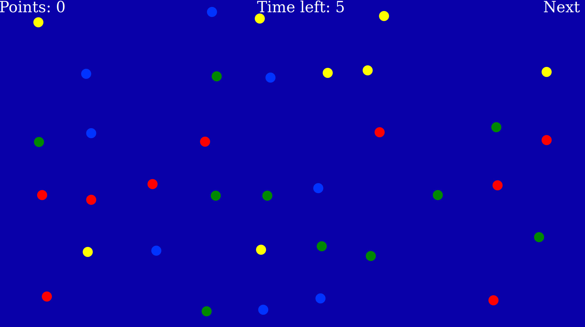

# Terminating a patch

There are several different options concerning how a patch is terminated. Most of them can be combined. When a patch is terminated, foragers are transferred into the next patch.

## Terminating by actively leaving a patch:
If you define a "next patch link" as shown below, foragers can actively leave the patch by clicking it.
```javascript
  patch: {
    // (further entries here, see default config)
    next_patch_click_html: "Next"
  },
```

## Terminating by collecting all targets:
If you set "trial_ends_when_all_collected: true" for a certain type of elements, then the trials ends when all of this type (and others that have the setting) are collected. Using this, you can implement exhaustive foraging. The example below requires collecting all targets but distractors don't matter:

```javascript
patch_types: [{
      id: "A",
      name: "Blub",
      elements: [{
          role: "target",
          positions: "repeated-1",
          amount: 2,
          images: ["disk-green.svg"],
          trial_ends_when_all_collected: true
        },
        {
          role: "distractor",
          positions: "repeated-1",
          amount: 2,
          images: ["disk-yellow.svg"],
        }
      ]
    },
    //(further patch types)
```

## Terminating when an error is made:

If you set "trial_ends_one_collected: true" for a certain type of elements, then the trials ends when a single element of this type (and others that have the setting) is collected. Using this, you can implement ending trials whe an error is made. We extend the example from above like this:

```javascript
patch_types: [{
      id: "A",
      name: "Blub",
      elements: [{
          role: "target",
          positions: "repeated-1",
          amount: 2,
          images: ["disk-green.svg"],
          trial_ends_when_all_collected: true
        },
        {
          role: "distractor",
          positions: "repeated-1",
          amount: 2,
          images: ["disk-yellow.svg"],
          trial_ends_when_all_collected: true 
        }
      ]
    },
    //(further patch types)
```

## Terminating when a points goal is reached:
You can define a points goal for each patch type. When that amount of points is reached, the trial ends. The example below illustrates how to have patches ended when 20 points are reached.

```javascript
patch_types: [{
      id: "A",
      name: "Blub",
      points_goal: 20,
      elements: [// list of elements goes here]
    },
    //(further patch types)
```

## Terminating after a certain duration in the patch:

You can also end a patch after a fixed duration. In ``config.js``, where the patch types are defined, you can add a ``timeout`` with a value in milliseconds. In the example below, the patch ends after 10 seconds and the participant is transferred into the next patch. 

```javascript
patch_types: [{
      id: "A",
      name: "Blub",
      timeout: 10000, // in ms
      elements: [// list of elements goes here]
    },
    //(further patch types)
```

If you want to display a countdown to the participant, you add a ``countdown_html`` entry to the general patch definition:

```javascript
   patch: {
    size: [
      1920,
      1080
    ],
    countdown_html:
      "<div id='countdown-html' class='countdown-display' style='left: 700px!'><font size=+4 face='Comic Sans MS' color='#FFFFFF'>Time left: %% </font></div>",
      /* Here might be more entries, such as
       indicate_points, points_display_html,
       next_patch_click_html, ... */
  },
```


  


