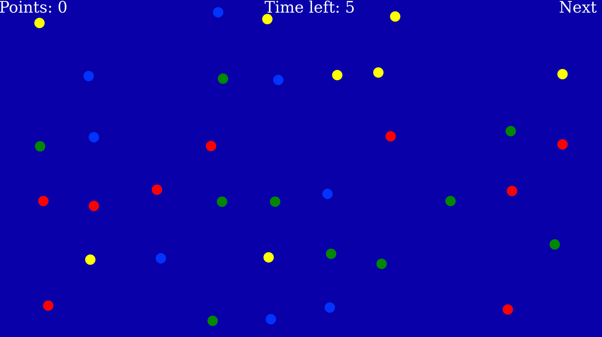

# Using Time Limits

  

## Limiting the time in a patch
To limit the time a participant can collect in a patch, you can define "timeouts" on the patch level.

In ``config.js``, where the patch types are defined, you can add a ``timeout`` with a value in milliseconds. In the example below, the patch ends after 5 seconds and the participant is transferred into the next patch.

```javascript
  "patch_types": [
    {
      "id": "A",
      "name": "ConditionA",
      "background_color": "#0A00AA",
      "travel_time": 1000,
      "timeout": 5000,
      "intro": "<p>Welcome to condition A!</p>",
      "elements": [/* this is where the list
                   of elements would be */]
    }
  ],

```
If you want to display a countdown to the participant, you add a ``countdown_html`` entry to the general patch definition:

```javascript
"patch": {
    "size": [
      1920,
      1080
    ],
    "countdown_html":
      "<div id='countdown-html' class='countdown-display' style='left: 700px!'><font size=+4 face='Comic Sans MS' color='#FFFFFF'>Time left: %% </font></div>",
    /* Here might be more entries, such as
       indicate_points, points_display_html,
       next_patch_click_html, ... */
  },
  ```

